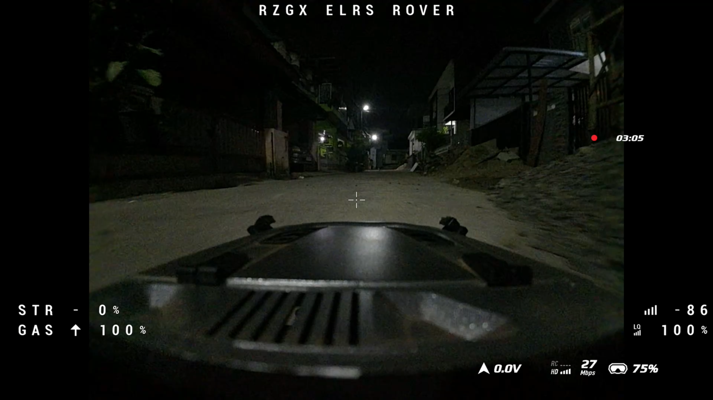
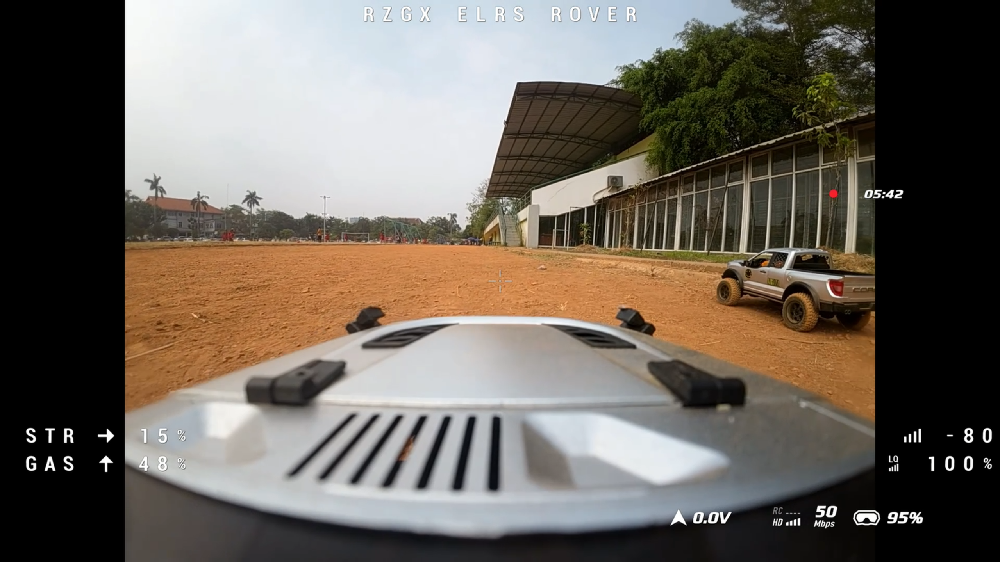
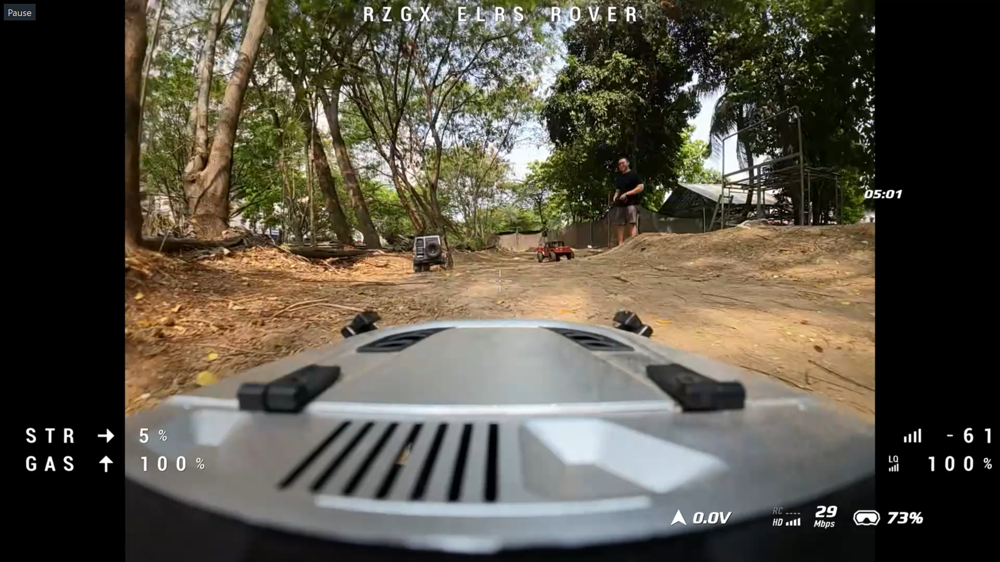
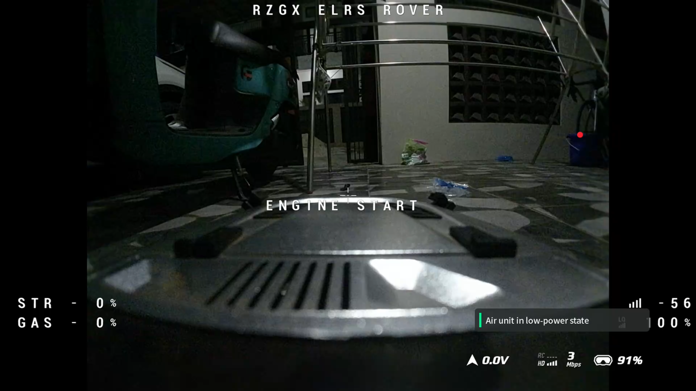

# RZGX Rover-ELRS Controller

RZGX Rover-ELRS Controller is an experimental ExpressLRS fork for RC ground
vehicles. It keeps a PWM receiver working as the vehicle receiver/controller,
while also sending a lightweight DJI MSP DisplayPort OSD directly to a DJI
O3/O4 Air Unit.

This project is focused on RC rovers, crawlers, trail trucks, and small
adventure vehicles. It is not a flight controller and it does not require
Betaflight, INAV, or any external FC.

> Current field baseline: **Stable 02 / MVP 0.5D**
>
> Target tested: **BETAFPV PWM 2.4GHz RX**
>
> ExpressLRS base: **4.0.1**
>
> RZGX firmware label: **4.0.1.5D**

## Stable Firmware Download

Current public baseline: **Stable 02 / MVP 0.5D**.

- Target: **BETAFPV PWM 2.4GHz RX**
- Binary: [`RZGX-Rover-ELRS-MVP-0.5D-BETAFPV-PWM-2G4RX.bin.gz`](work/builds/RZGX-Rover-ELRS-MVP-0.5D-BETAFPV-PWM-2G4RX.bin.gz)
- Release notes: [`Stable 02 / MVP 0.5D`](docs/releases/STABLE-02-MVP-0.5D.md)

Flash only to the exact receiver target above. Other ExpressLRS receivers are
not validated by this baseline.

## What It Does

The receiver continues to provide PWM outputs for vehicle control, while the
same receiver also renders a small OSD through MSP DisplayPort.

Current MVP OSD:

- Craft Name
- STANDBY state
- ENGINE START arming transition
- Steering percentage
- Gas percentage
- RSSI value
- Link Quality value

The OSD is intentionally simple so the receiver radio link stays stable.

## Tested Hardware

Stable 02 / MVP 0.5D has been field-tested on:

- BETAFPV PWM 2.4GHz RX
- RadioMaster Boxer with internal 2.4GHz ELRS transmitter
- 150Hz packet rate
- 1000mW maximum TX power with Dynamic Power enabled
- ExpressLRS 4.0.1 firmware base
- DJI O3 Air Unit
- DJI Goggles
- RC ground vehicles including crawler/adventure and faster trail use cases

The same firmware was tested on two receivers of the same target type. Both
receivers were able to use their own Craft Name and Binding Phrase through the
receiver WiFi Configurator.

## Field Test Gallery

These field captures show the rover OSD during daytime range testing, extended
full-throttle use, a night run, and the ENGINE START transition.

| Night adventure | Approximately 80-meter range test |
| --- | --- |
|  |  |
| Extended full-throttle use | ENGINE START OSD |
|  |  |

The values shown are field observations captured through the DJI OSD, not
calibrated laboratory measurements. See [docs/TEST_LOG.md](docs/TEST_LOG.md)
for the recorded observations.

## Required Receiver Output Mapping

For the tested BETAFPV PWM receiver target:

| Output | Function |
| --- | --- |
| Output 1 | CH1 / Steering PWM |
| Output 2 | Serial TX to DJI Air Unit RX |
| Output 3 | Serial RX from DJI Air Unit TX |
| Output 4 | CH2 / Gas PWM |
| Output 5 | CH3 PWM |

In the receiver WiFi Configurator, configure:

- Output 2 as `TX`
- Output 3 as `RX`
- Serial protocol as DisplayPort/MSP DisplayPort
- Rover OSD enabled

The exact labels can depend on the ExpressLRS configurator page, but the tested
setup uses Output 2/3 for the UART pair.

## DJI Air Unit Wiring

The tested rover setup powers the ELRS PWM receiver and the DJI Air Unit from
separate power sources. Because of that, a shared ground is required for the
UART signal to work correctly.

Tested power layout:

- ELRS PWM receiver: powered by the vehicle receiver/ESC 5V rail.
- DJI O3/O4 Air Unit: powered from a separate external LiPo/BEC supply.
- Grounds: receiver ground and Air Unit power ground are connected together.

Receiver side:

| Receiver Pin | Connects To |
| --- | --- |
| Output 2 `S` / TX | DJI Air Unit RX |
| Output 2 `V` | Not connected |
| Output 2 `G` | DJI Air Unit GND |
| Output 3 `S` / RX | DJI Air Unit TX |
| Output 3 `V` | Not connected |
| Output 3 `G` | Optional / not required when Output 2 GND is connected |

DJI Air Unit side:

| DJI Air Unit Pin | Connects To |
| --- | --- |
| VCC | External Air Unit power positive |
| GND | External Air Unit power negative AND receiver ground |
| RX | Receiver Output 2 `S` / TX |
| TX | Receiver Output 3 `S` / RX |
| SBUS | Not used |
| SBUS GND | Not used |

Important:

- TX and RX must cross: receiver TX goes to Air Unit RX, and Air Unit TX goes
  to receiver RX.
- Do not connect the receiver output `V` pin to the DJI Air Unit power pin.
- If the Air Unit uses a separate battery or BEC, common ground is mandatory.

## Flashing

The tested update path is the normal ExpressLRS receiver WiFi update page.

1. Put the receiver into WiFi mode.
2. Open the receiver WiFi Configurator.
3. Go to **Update**.
4. Upload the correct `firmware.bin.gz` for the same target.
5. Reboot the receiver.
6. Set the required output mapping and Rover OSD options.

Use only the binary that matches the exact receiver target. A wrong target can
make the receiver fail to boot or require recovery through USB-to-UART.

### USB-to-UART Recovery Note

If WiFi flashing or WiFi mode is unavailable, recovery may be possible with a
3.3V USB-to-UART adapter such as a CP2102.

Field-tested recovery wiring:

- CP2102 TX -> receiver RX
- CP2102 RX -> receiver TX
- CP2102 GND -> receiver GND
- Hold the receiver BOOT button before starting the flash and keep holding it
  until flashing finishes.

In the tested recovery case, USB power was enough and no separate 5V supply was
needed. Use the exact **BETAFPV PWM 2.4GHz RX** target when recovering.

## Configuration Notes

Binding should be configured through the standard ExpressLRS receiver WiFi
Configurator.

Recommended field workflow:

- Flash the RZGX firmware binary.
- Set the user's Binding Phrase or Binding UID in the WiFi Configurator.
- Set Craft Name in the Rover OSD page.
- Confirm Output 2/3 are mapped as Serial TX/RX.
- Confirm Output 4/5 are still mapped to the desired PWM channels.

Do not patch the firmware binary directly unless you fully understand the
ExpressLRS firmware options block. Incorrect binary patching can break binding,
runtime options, or receiver boot behavior.

## Stable Baseline

See:

- [STABLE-BASELINE.md](STABLE-BASELINE.md)
- [docs/releases/STABLE-02-MVP-0.5D.md](docs/releases/STABLE-02-MVP-0.5D.md)

Stable 02 / MVP 0.5D was selected after repeated indoor and outdoor tests where:

- OSD displayed consistently.
- Link quality stayed stable.
- No repeated telemetry lost / telemetry recovered loop was observed.
- CH2 continuous use stayed stable.
- The same target receiver type also worked on another vehicle.

## Relationship to ExpressLRS Upstream

This is an opinionated RZGX rover-focused fork.

ExpressLRS upstream is the base radio firmware. The RZGX changes are a niche
ground-vehicle layer on top of it: receiver-side DJI MSP DisplayPort OSD, rover
OSD layout, and tested PWM receiver mapping.

This project is not intended to replace a generic upstream DisplayPort feature.
If ExpressLRS upstream accepts or evolves generic receiver-side MSP DisplayPort
support, RZGX Rover-ELRS Controller can later be rebased or adapted on top of
that upstream work.

## Acknowledgements

Created and maintained by **Rizangg / RZGX**.

This fork is based on [ExpressLRS](https://github.com/ExpressLRS/ExpressLRS).
All upstream ExpressLRS contributors deserve credit for the radio link,
receiver, PWM, WiFi configuration, and build system foundation.

Special thanks to **Renaldy FPV / aldyduino** for early MSP DisplayPort
reference work, technical discussion, and his related ExpressLRS receiver-side
DisplayPort work.

Related references:

- [ExpressLRS](https://github.com/ExpressLRS/ExpressLRS)
- [aldyduino/ESP32MSPDisplayPort](https://github.com/aldyduino/ESP32MSPDisplayPort)
- [ExpressLRS PR #3703](https://github.com/ExpressLRS/ExpressLRS/pull/3703)

This project was developed with AI-assisted coding support from OpenAI Codex /
ChatGPT. Hardware testing, project direction, and final field validation remain
with the maintainer.

## License

This project is a fork of ExpressLRS and follows the upstream license terms.
Keep the upstream license and copyright notices when redistributing source or
binary builds.

See [LICENSE](LICENSE).
